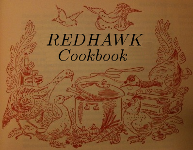

REDHAWK Cookbook
================

This is the source code for the REDHAWK Cookbook.

This work is licensed under a [Creative Commons Attribution-ShareAlike
3.0 Unported
License](http://creativecommons.org/licenses/by-sa/3.0/deed.en_US)

Copyright (C) 2013 Axios, Inc and others.

Errata
======

The REDHAWK Cookbook is authored in the
[Pandoc](http://johnmacfarlane.net/pandoc/demo/example9/pandocs-markdown.html)
style of [Markdown](http://daringfireball.net/projects/markdown).

Similar to other technical "Cookbooks", the book is organized by topics
that have a set of "recipes" within them. If you aren't familiar with
this style of book, see any of the [O'Reilly
Cookbooks](http://shop.oreilly.com/category/series/cookbooks.do).

Each topic is a folder and each recipe is a single Markdown file. To
start a new recipe, copy template/recipe.md.

Images should go into the figures/ folder. They should be in .png
format.
